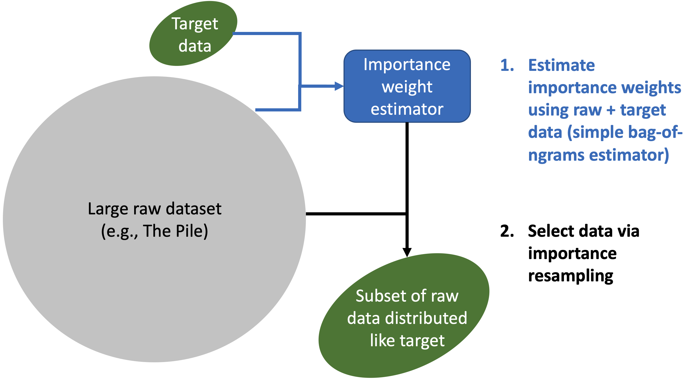

# Data Selection for Language Models via Importance Resampling (DSIR)
[](https://opensource.org/licenses/MIT)
[](https://arxiv.org/abs/2302.03169)
[](https://badge.fury.io/py/data-selection)

This repository contains the [DSIR](https://arxiv.org/abs/2302.03169) data selection tool for selecting relevant language model training data from any raw data source given a target dataset, as well as pre-filtered datasets and some pretrained models.

DSIR is built for:
- fast, large-scale (trillion-token scale) data selection from large raw text datasets (Pile, RefinedWeb, RedPajama, ...). There is almost no overhead to selecting more examples (unlike retrieval), other than the time it takes to write the extra examples to disk.
- selecting data that is distributed like a given target dataset (domain-specific data, Wikipedia, ...). Relevance and diversity are balanced automatically by matching the distribution of the target dataset on a feature space (e.g., n-gram frequencies).

Compute needed:
- 1 CPU node
- a decent amount of RAM (at least 64GB for most large datasets - need to hold a few floats per example in memory)
- a high number of cores. The data selection speed scales linearly with the CPU cores.



Code related to the DSIR paper's experiments are in the `experimental/` directory.

## Quickstart

Install with pip:
```
pip install data-selection
```

Install from source by cloning this repo and installing via pip:
```
git clone git@github.com:/p-lambda/dsir
pip install ./dsir
```

To select data, simply initialize a `HashedNgramDSIR` object and call the following functions:
```python
from data_selection import HashedNgramDSIR

raw_datasets = [<list of paths>]
target_datasets = [<list of paths>]

dsir = HashedNgramDSIR(raw_datasets, target_datasets, cache_dir='/scr/dsir_cache')
dsir.fit_importance_estimator(num_tokens_to_fit='auto')
dsir.compute_importance_weights()
dsir.resample(out_dir='resampled', num_to_sample=10000000, cache_dir='/scr/resampled_cache')
```
Running this would write 10M documents in `jsonl` files inside an output directory named `resampled`. The files will first be written to `cache_dir` and moved to `out_dir` upon completion (set `cache_dir` to `None` to skip this step). For best performance, use uncompressed `jsonl` files stored on local file storage for all data paths and use as many CPU cores as possible, which allows each file to be virtually sharded across multiple cores. Custom functions for reading the data paths and extracting the text field from each example can be provided via the
`{raw,target}_load_dataset_fn` and `{raw,target}_parse_example_fn` arguments to the constructor. The number of tokens to use for fitting the importance weight estimator can be tuned with the `num_tokens_to_fit` argument (set to `all` to fit on full dataset). Top-k retrieval instead of sampling without replacement (the default) can be done by specifying `top_k=True` to the `resample` method.
 
The `dsir` intermediate results (after `fit_importance_estimator` and `compute_importance_weights`) can be saved and loaded for later use, for example to resample 100M documents instead:
```python
dsir.save('dsir_params.pkl')

# later on
dsir.load('dsir_params.pkl')
dsir.resample(out_dir='resampled', num_to_sample=100000000, cache_dir='/scr/resampled_cache')
```
The `save` method can be called at any time to save partial results.

See [Usage documentation](data_selection/README.md) for full details.


## Speed benchmark on The Pile
Using 1 CPU node with 96GB RAM and 96 cores, we can select data from the full (decompressed) Pile dataset in less than *4.5 hours*.
The Pile dataset was first decompressed and placed onto the node's local file storage. The breakdown of timings for each step are:
- *Fit importance estimator* (with `num_tokens_to_fit="auto"`): 59.28 seconds
- *Compute importance weights*: 4.36 hours
- *Resample 10M documents* (with `cache_dir=None` and `out_dir` is a local storage location): 353.68 seconds
- *Total*: 4.47 hours

Subsequent resampling with the same target data is very cheap, and the runtime does not scale with the number of documents to select (unlike retrieval). Resampling 100M documents takes the same amount of time (less than *6 minutes*) as resampling 10M documents:
- *Resample 10M documents*: 353.68 seconds
- *Resample 100M documents*: 352.69 seconds

## Examples

To select data from the Pile:
```python
from data_selection import HashedNgramDSIR

# 2-digit integers up to 29
subsets = [str(i).zfill(2) for i in range(0, 30)]

raw_datasets = [f'/path/to/pile/{subset}.jsonl' for subset in subsets]
target_datasets = ['/path/to/target.jsonl']

dsir = HashedNgramDSIR(
        raw_datasets=raw_datasets,
        target_datasets=target_datasets,
        cache_dir='/path/to/dsir_cache')
dsir.fit_importance_estimator(num_tokens_to_fit='auto')
dsir.compute_importance_weights()
dsir.resample(out_dir='/path/to/out_dir', num_to_sample=10000000, cache_dir='/path/to/resample_cache')
```

HuggingFace datasets can also be used in either `raw_datasets` or `target_datasets` (note: streaming a large raw dataset directly will be very slow - we recommend this more for target datasets):
```python
from data_selection import HashedNgramDSIR

subsets = [str(i).zfill(2) for i in range(0, 30)]

raw_datasets = [f'/path/to/pile/{subset}.jsonl' for subset in subsets]
target_datasets = ['codeparrot/self-instruct-starcoder', 'SetFit/mnli']

def target_load_dataset_fn(dataset):
    if dataset == 'codeparrot/self-instruct-starcoder':
        ds = load_dataset(dataset, streaming=True, split='raw')
    else:
        ds = load_dataset(dataset, streaming=True, split='train').take(10000)
    return ds

def target_parse_example_fn(ex):
    if 'output' in ex:
        return ex['output']
    else:
        return ex['text1'] + ' ' + ex['text2']

dsir = HashedNgramDSIR(
        raw_datasets=raw_datasets,
        target_datasets=target_datasets,
        cache_dir='/path/to/dsir_cache',
        separate_targets=True)
dsir.fit_importance_estimator(num_tokens_to_fit='auto')
dsir.compute_importance_weights()
dsir.resample(out_dir='/path/to/out_dir', num_to_sample=10000000, cache_dir='/path/to/resample_cache')
```
For use-cases where the target datasets are quite different (here, a mix of code and natural language), we recommend passing in `separate_targets` into the constructor. `separate_targets` controls whether to select data separately for each target and then join them. For example, when including two target datasets, one natural language dataset and one code, the most heavily upweighted data when `separate_targets=False` may skew towards documents with a mix of natural language and code, such as StackExchange. When `separate_targets=True`, two separate DSIR runs will occur in parallel, selecting a mixture of documents using each target according to `target_proportions`. When `target_proportions` is unspecified, the selected data is weighted according to the token sizes of each target dataset.


## Citation Information
Paper: <https://arxiv.org/abs/2302.03169>
```
@article{xie2023data,
  author = {Sang Michael Xie and Shibani Santurkar and Tengyu Ma and Percy Liang},
  journal = {Advances in Neural Information Processing Systems (NeurIPS)},
  title = {Data Selection for Language Models via Importance Resampling},
  year = {2023},
}
```

